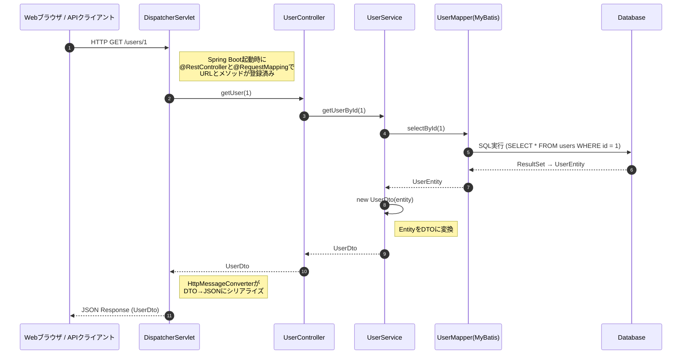
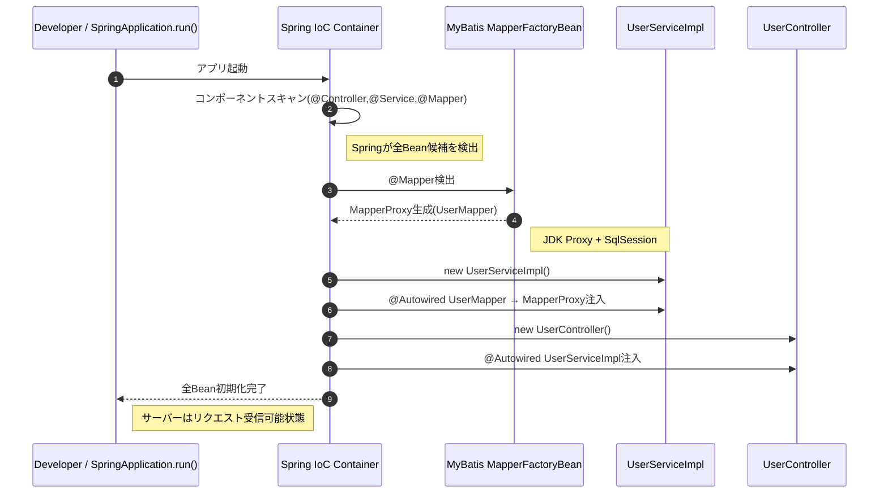
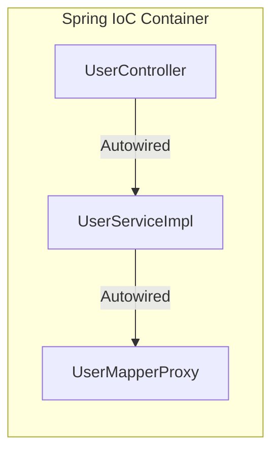

[TOC]

# プロジェクトの進捗

    これはMermaidを使った簡単なフローチャートです。

## ユーザー認証シーケンス

    ユーザーがログインする際のフローです。

```mermaid
sequenceDiagram
    autonumber
    participant Client as Webブラウザ / APIクライアント
    participant Dispatcher as DispatcherServlet
    participant Controller as UserController
    participant Service as UserService
    participant Mapper as UserMapper(MyBatis)
    participant DB as Database

    %% リクエスト受信
    Client->>Dispatcher: HTTP GET /users/1
    note right of Dispatcher: Spring Boot起動時に<br>@RestControllerと@RequestMappingで<br>URLとメソッドが登録済み

    %% Controller呼び出し
    Dispatcher->>Controller: getUser(1)

    %% Service呼び出し
    Controller->>Service: getUserById(1)

    %% Mapper呼び出し
    Service->>Mapper: selectById(1)
    Mapper->>DB: SQL実行 (SELECT * FROM users WHERE id = 1)
    DB-->>Mapper: ResultSet → UserEntity
    Mapper-->>Service: UserEntity

    %% DTO生成
    Service->>Service: new UserDto(entity)
    note right of Service: EntityをDTOに変換

    %% Controllerへ戻す
    Service-->>Controller: UserDto
    Controller-->>Dispatcher: UserDto
    note right of Dispatcher: HttpMessageConverterが<br>DTO→JSONにシリアライズ

    %% レスポンス返却
    Dispatcher-->>Client: JSON Response (UserDto)

```

```mermaid
sequenceDiagram
    autonumber
    participant Dev as Developer / SpringApplication.run()
    participant Container as Spring IoC Container
    participant MapperFactory as MyBatis MapperFactoryBean
    participant Service as UserServiceImpl
    participant Controller as UserController

    %% アプリ起動
    Dev->>Container: アプリ起動

    %% Beanスキャン
    Container->>Container: コンポーネントスキャン(@Controller,@Service,@Mapper)
    note right of Container: Springが全Bean候補を検出

    %% MapperProxy生成
    Container->>MapperFactory: @Mapper検出
    MapperFactory-->>Container: MapperProxy生成(UserMapper)
    note right of MapperFactory: JDK Proxy + SqlSession

    %% Service生成とDI
    Container->>Service: new UserServiceImpl()
    Container->>Service: @Autowired UserMapper → MapperProxy注入

    %% Controller生成とDI
    Container->>Controller: new UserController()
    Container->>Controller: @Autowired UserServiceImpl注入

    %% 起動完了
    Container-->>Dev: 全Bean初期化完了
    note right of Dev: サーバーはリクエスト受信可能状態

```

```mermaid
graph TD
    subgraph Container[Spring IoC Container]
        direction TB
        Controller[UserController]
        Service[UserServiceImpl]
        Mapper[UserMapperProxy]
    end

    %% 依存関係を矢印で表現
    Controller -->|Autowired| Service
    Service -->|Autowired| Mapper

```
