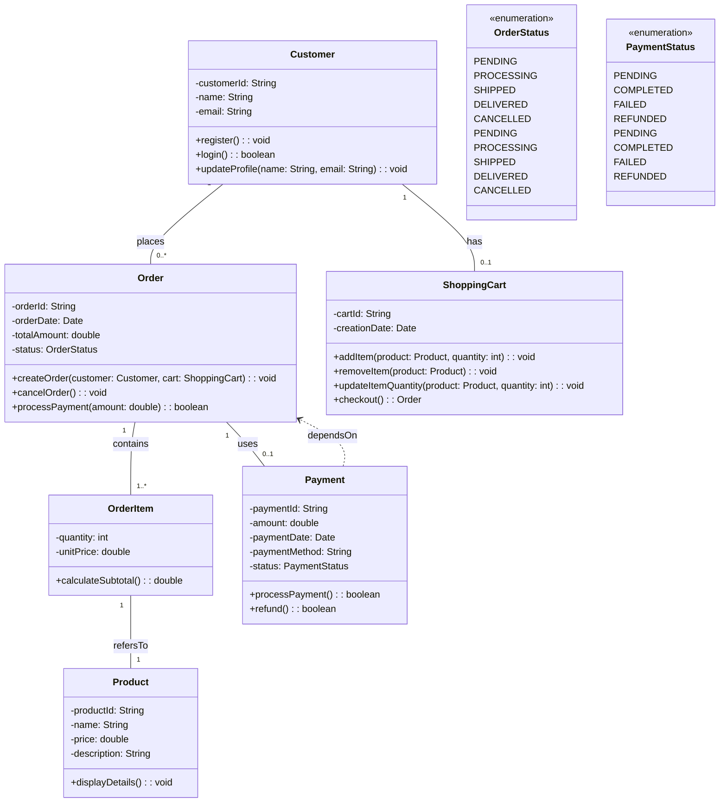

### クラス図の主要な要素

1.  **クラス (Class)**

    - クラス名、属性（フィールド）、操作（メソッド）で構成されます。
    - 通常、3 つの区画に分かれた長方形で表現されます。

    ```mermaid
    classDiagram
        class ClassName {
            -attribute: Type
            +operation(parameter: Type): ReturnType
        }
    ```

2.  **属性 (Attributes)**

    - クラスが持つデータ（変数）を表します。
    - 可視性（`+`public, `-`private, `#`protected, `~`package）を先頭に付けます。

    ```mermaid
    classDiagram
        class Person {
            -name: String
            +age: int
            #address: String
        }
    ```

3.  **操作 (Operations/Methods)**

    - クラスが実行できる振る舞い（関数）を表します。
    - 属性と同様に可視性を先頭に付けます。
    - 引数と戻り値の型も記述します。

    ```mermaid
    classDiagram
        class Calculator {
            +add(x: int, y: int): int
            -subtract(x: int, y: int): int
            +multiply(x: int, y: int): int
        }
    ```

### クラス間の関係

UML クラス図では、クラス間のさまざまな関係を表現できます。

1.  **関連 (Association)**

    - 2 つ以上のクラス間の構造的な関係を示します。
    - 実線で表現され、多重度（カーディナリティ）や役割名（ロール）を記述できます。
    - **多重度:**
      - `1`: 厳密に 1 つ
      - `0..1`: 0 または 1 つ
      - `*`または`0..*`: 0 個以上（任意）
      - `1..*`: 1 個以上
      - `m..n`: m から n 個

    ```mermaid
    classDiagram
        Customer "1" -- "*" Order : places
        Order "1" -- "1..*" LineItem : contains
    ```

2.  **集約 (Aggregation)**

    - 全体と部分の関係を表しますが、部分が全体から独立して存在できる場合に用います。（"has-a"の関係）
    - 全体側のクラスにひし形の記号を付けた実線で表現します。

    ```mermaid
    classDiagram
        Car "1" o-- "4" Wheel : has
    ```

3.  **コンポジション (Composition)**

    - 集約よりも強い全体と部分の関係を表します。部分が全体に強く依存し、全体が破棄されると部分も破棄される場合に用います。
    - 全体側のクラスに塗りつぶされたひし形の記号を付けた実線で表現します。

    ```mermaid
    classDiagram
        House "1" *-- "1" Kitchen : contains
    ```

4.  **汎化 (Generalization/Inheritance)**

    - 継承関係を示します。サブクラスがスーパークラスの属性や操作を引き継ぐことを表します。（"is-a"の関係）
    - サブクラスからスーパークラスへ向かう、中が空の三角矢印が付いた実線で表現します。

    ```mermaid
    classDiagram
        Animal <|-- Dog
        Animal <|-- Cat
        class Animal {
            +eat()
        }
        class Dog {
            +bark()
        }
        class Cat {
            +meow()
        }
    ```

5.  **実現 (Realization/Implementation)**

    - インターフェースと、それを実装するクラスの関係を示します。
    - 実装クラスからインターフェースへ向かう、中が空の三角矢印が付いた点線で表現します。

    ```mermaid
    classDiagram
        interface Runnable
        Runnable <|.. Thread
        class Runnable {
            +run()
        }
        class Thread {
            +start()
        }
    ```

6.  **依存 (Dependency)**

    - あるクラスが別のクラスの変更に依存していることを示します。通常、一時的な関係や引数として使用される場合などに使われます。
    - 依存するクラスから依存されるクラスへ向かう、点線で表現します。

    ```mermaid
    classDiagram
        Client ..> Service : uses
        class Client {
            +request()
        }
        class Service {
            +process()
        }
    ```

### 具体例：シンプルな EC サイトのクラス図



この例では、`Customer`、`Product`、`Order`、`OrderItem`、`ShoppingCart`、`Payment`というクラスと、それらの間の関連が定義されています。また、列挙型（Enumeration）として`OrderStatus`と`PaymentStatus`も表現しています。

Mermaid を使うことで、コードベースで UML クラス図を簡単に記述し、共有することができます。
