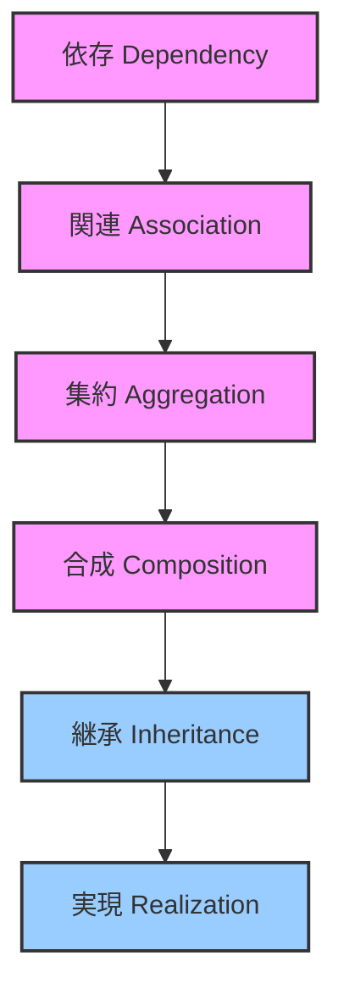

## UML クラス図における関係性の比較と使い分け

UML クラス図の主要な関係性は、オブジェクト間の「繋がり」の強さと性質を表します。適切な関係性を選ぶことで、システム設計の意図がより明確になり、コードの保守性や拡張性に影響を与えます。

### 1. 関係性強度の全体像

まずは、関係性の強さを大まかに比較してみましょう。



**傾向:**

- **水平方向 (Dependency → Association → Aggregation → Composition):** 「has-a（〜を持っている）」関係が強くなる。ライフサイクルの一体性が増す。
- **垂直方向 (Inheritance, Realization):** 「is-a（〜の一種である）」や「implements（〜を実装する）」といった、型と振る舞いの関係。

---

### 2. 関係性ごとの詳細比較と線引き

以下の表で、各関係性の特徴、Java での対応、そして使い分けのポイントを比較します。

| 関係性                 | 関係の強さ | ライフサイクル共有 | 役割               | Java での典型例                                                               | 線引きのポイント                                                                                                                                                                                                                                                                                                                                                                                                           | Mermaid 記法 |
| ---------------------- | ---------- | ------------------ | ------------------ | ----------------------------------------------------------------------------- | -------------------------------------------------------------------------------------------------------------------------------------------------------------------------------------------------------------------------------------------------------------------------------------------------------------------------------------------------------------------------------------------------------------------------- | ------------ |
| **依存 (Dependency)**  | 弱い       | しない             | 一時的な利用       | メソッド引数、ローカル変数、static メソッド呼び出し、特定の例外クラスへの参照 | **一時的な「利用」かどうか？** クラス A がクラス B なしではコンパイルは通るが、実行時にクラス B の情報が必要となる場合。フィールドとして保持せず、メソッドのスコープ内でのみ登場するなら依存。A が B の変更によって影響を受けるが、B は A を知る必要がない場合に最適。                                                                                                                                                     | `..>`        |
| **関連 (Association)** | 中         | しない             | 継続的な参照       | フィールド参照、オブジェクトのリストやマップとして保持                        | **永続的な「知っている」関係かどうか？** クラス A がクラス B のインスタンスをフィールドとして保持し、長期間にわたってその B を利用する場合。A と B が概念的に独立して存在できる場合に用いる。**集約・合成の基準に当てはまらない「has-a」関係**はこれ。                                                                                                                                                                     | `--`         |
| **集約 (Aggregation)** | 中         | しない             | 全体と部分（独立） | `Department` と `Employee`、`Library` と `Book`                               | **「全体と部分」の関係で、部分が全体から独立して存在できるか？** 全体（コンテナ）が破棄されても、部分（要素）がシステム内で引き続き意味を持つ場合。例えば、部署がなくなっても社員は会社に残り、別の部署に異動できる。図書館がなくなっても本は本として存在し得る。**「has-a」関係の中でも、特に全体-部分の関係であることを強調したい場合**に用いる。                                                                        | ` o--`       |
| **合成 (Composition)** | 強い       | する               | 全体と部分（一体） | `Car` と `Engine`、`Window` と `Scrollbar`、`Order` と `OrderItem`            | **「全体と部分」の関係で、部分が全体のライフサイクルに強く依存するか？** 全体が破棄されると、部分も意味をなさなくなるか、一緒に破棄される場合。例えば、車がなければエンジンは車の一部として機能しない。ウィンドウが閉じればスクロールバーも消える。**部分が全体なしでは存在意義が薄れる「has-a」関係**に最適。部分クラスのインスタンスは通常、全体クラスのコンストラクタで生成されるか、全体クラスの内部でのみ管理される。 | `*-- `       |
| **継承 (Inheritance)** | 強い       | サブはスーパに従う | 汎化と特化         | `Animal` と `Dog` / `Cat`、`Shape` と `Circle` / `Square`                     | **「is-a」の関係か？** サブクラスがスーパークラスの「一種である」と言えるか？ スーパークラスの振る舞いを再利用し、さらに独自の振る舞いを追加・変更（オーバーライド）する場合。コードの再利用と多態性（ポリモーフィズム）を実現する。**「〜の一種」と表現できる場合にのみ使用する。**                                                                                                                                       | `<\| -- `    |
| **実現 (Realization)** | 強い       | 実装は契約に従う   | 契約の実装         | `Runnable` と `MyTask`、`List` と `ArrayList` / `LinkedList`                  | **インターフェースの「契約」を実装するか？** インターフェースで定義されたメソッドのシグネチャを、クラスが具体的に実装する関係。多態性（ポリモーフィズム）を実現し、実装の詳細を隠蔽する。**「〜の機能を提供する」または「〜の役割を果たす」**と表現できる場合に用いる。継承とは異なり、振る舞いの強制と型の互換性を提供する。                                                                                              | `<\| ..`     |

---

### 3. 具体例による使い分けのイメージ

ここでは、より具体的なシナリオでどの関係性を選ぶべきかを考えてみましょう。

#### シナリオ 1: 注文処理システム

- **`OrderProcessor` と `Order` (依存):**

  - `OrderProcessor` は `processOrder(Order order)` のように、一時的に `Order` オブジェクトを「使って」処理を行います。`OrderProcessor` は `Order` をフィールドとして保持せず、処理が終われば関係は切れます。

  ```mermaid
  classDiagram
      class OrderProcessor {
          + processOrder(order: Order)
      }
      class Order {
          - orderId: String
      }
      OrderProcessor ..> Order : <<uses>>
  ```

- **`Customer` と `Order` (関連):**

  - `Customer` は複数の `Order` を「持っています」。`Customer` オブジェクトが生きている間、その `Order` のリストを保持し続けます。しかし、`Customer` が削除されても、個々の `Order` は履歴として残るなど、独立したライフサイクルを持つことができます。

  ```mermaid
  classDiagram
      class Customer {
          - orders: List<Order>
      }
      class Order {
          - orderId: String
      }
      Customer "1" -- "0..*" Order : places
  ```

- **`Order` と `OrderItem` (合成):**
  - `Order` は複数の `OrderItem` (注文明細) を「持っています」。`OrderItem` は特定の `Order` がなければ存在意義がありません。`Order` がキャンセルされれば、その `OrderItem` も同時に意味を失います。
  ```mermaid
  classDiagram
      class Order {
          - orderItems: List<OrderItem>
      }
      class OrderItem {
          - productId: String
          - quantity: int
      }
      Order "1" *-- "1..*" OrderItem : contains
  ```

#### シナリオ 2: 図形描画システム

- **`Shape` と `Circle` / `Rectangle` (継承):**

  - `Circle` は `Shape` の「一種」であり、`Rectangle` も `Shape` の「一種」です。共通の `draw()` メソッドなどを `Shape` で定義し、各サブクラスで具体的な描画方法を実装します。

  ```mermaid
  classDiagram
      class Shape {
          + draw()
          + calculateArea(): double
      }
      class Circle {
          - radius: double
      }
      class Rectangle {
          - width: double
          - height: double
      }
      Shape <|-- Circle : extends
      Shape <|-- Rectangle : extends
  ```

- **`Drawable` インターフェースと `Shape` (実現):**
  - `Drawable` は `draw()` メソッドの契約を定義するインターフェースです。`Shape` クラス（またはそのサブクラス）がこの `Drawable` インターフェースを実装することで、「描画可能」という能力（契約）を提供します。
  ```mermaid
  classDiagram
      class Drawable {
         <<interface>>
          + draw()
      }
      class Shape {
          + draw()
      }
      Drawable <|.. Shape : implements
  ```

---

### まとめ

- **依存:** 最も弱く、一時的な「利用」
- **関連:** 永続的な「知っている」関係。独立したライフサイクル。
- **集約:** 全体と部分だが、部分が全体から独立して存在できる「has-a」
- **合成:** 全体と部分で、部分が全体と運命共同体の「has-a」
- **継承:** 「is-a」の関係。汎化と特化による機能の再利用と拡張。
- **実現:** インターフェースの「契約」の実装。特定の能力（振る舞い）の保証。

これらの比較と具体例が、UML クラス図を書く際に適切な関係性を選択する助けになれば幸いです。
